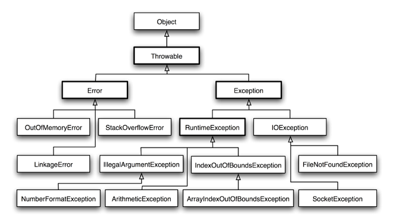

# Exception

### Summary



### Different between throw and throws

Following are the differences between two:<br>
* throw keyword is used to throw Exception from any method or static block whereas throws is used to indicate that which Exception can possibly be thrown by this method. If any method throws checked Exception, then caller can either handle this exception(using try catch block )or can re throw it by declaring another ‘throws’ clause in method declaration.
* throw clause can be used in any part of code where you feel a specific exception needs to be thrown to the calling method

E.g.
```
//throw
throw new Exception(“You have some exception”)
throw new IOException(“Connection failed!!”)
//throws
throws IOException, NullPointerException, ArithmeticException
```


### How to catch an exception thrown by another thread in Java?

This can be done using Thread.UncaughtExceptionHandler.

```
// create our uncaught exception handler
Thread.UncaughtExceptionHandler handler = new Thread.UncaughtExceptionHandler() {
    public void uncaughtException(Thread th, Throwable ex) {
        System.out.println("Uncaught exception: " + ex);
    }
};

// create another thread
Thread otherThread = new Thread() {
    public void run() {
        System.out.println("Sleeping ...");
        try {
            Thread.sleep(1000);
        } catch (InterruptedException e) {
            System.out.println("Interrupted.");
        }
        System.out.println("Throwing exception ...");
        throw new RuntimeException();
    }
};

// set our uncaught exception handler as the one to be used when the new thread
// throws an uncaught exception
otherThread.setUncaughtExceptionHandler(handler);

// start the other thread - our uncaught exception handler will be invoked when
// the other thread throws an uncaught exception
otherThread.start();
```